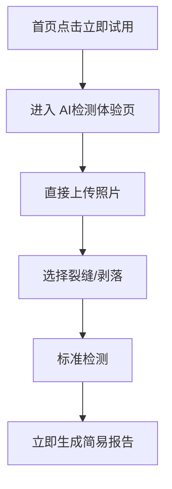
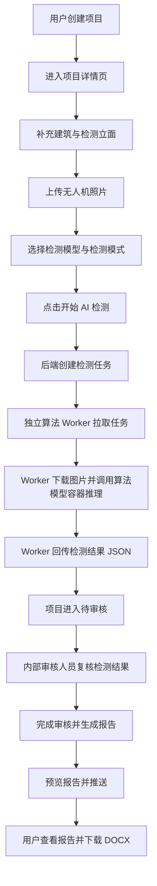

# 外墙巡检智能平台开发目标说明
 
> 系统形态：B/S 架构 Web 平台  
> 技术栈：React + TypeScript + Vite + HeroUI + react-konva / FastAPI / PostgreSQL / MinIO / Redis + RQ / Docker Compose  
> 算法形态：独立算法 Worker 拉取检测任务，完成推理后回传检测结果 JSON；正式环境中系统前后端与算法模型部署在同一台服务器，Worker 跟随算法模型部署，建议与模型使用不同 Docker 容器隔离

---

## 1. 项目目标

开发一个面向建筑外墙巡检场景的智能检测与报告平台。平台支持用户创建外墙检测项目、配置建筑和检测立面、上传无人机照片、选择 AI 检测模型、启动检测任务；系统通过后端任务接口对接独立算法 Worker 进行缺陷识别，返回裂缝、剥落、空鼓、渗漏、锈蚀等缺陷结果；内部审核人员在审核工作台对 AI 结果进行确认、修正、删除和补充，完成后生成检测报告并推送给用户查看。平台首页同时提供独立的简易 AI 检测体验入口，用于非存档、非审核、无项目流程的快速试用。

---

## 2. 角色与使用边界

### 2.1 普通用户

普通用户可见功能：

- 首页
- AI 检测体验
- AI 检测能力介绍
- 项目管理
- 新建项目
- 项目详情
- 检测时段推荐
- 上传照片
- 选择检测模型与检测模式
- 启动 AI 检测
- 查看最终检测报告
- 下载 DOCX 报告

普通用户不可见功能：

- 审核工作台
- AI 原始结果审核
- 人工修正过程
- 报告推送前的内部状态

### 2.2 内部审核人员

内部人员可见功能：

- 审核工作台
- 待审核项目列表
- AI 检测结果查看
- 缺陷框确认、修正、删除、补充
- 完成审核并生成报告
- 预览报告并推送

---

## 3. 核心业务流程

### 3.1 简易试用流程



简易试用规则：

1. 首页“立即试用”只进入 `AI检测体验` 页面，不进入正式新建项目页。
2. 体验页无需填写项目信息，无需选择无人机型号。
3. 体验页直接上传照片，单次文件总量限制 100MB。
4. 体验页仅支持裂缝、剥落两类检测模型。
5. 体验页仅支持标准检测，不支持高精度检测。
6. 体验结果只生成简易报告，不存档、不进入审核、不触发正式检测任务和报告推送流程。

### 3.2 正式项目流程



### 3.3 算法部署边界

当前开发测试环境不部署真实算法模型。第 5 阶段先实现后端检测任务、Worker API 契约和模拟 Worker，用固定 JSON 验证完整业务流转。

正式部署时，系统前端、后端和算法侧服务部署在同一台正式服务器。Worker 是算法侧组件，跟随算法模型部署，负责对接平台任务 API 和模型推理接口；为了安全和运维边界，推荐 Worker 与模型拆成不同 Docker 容器：

- `algorithm-worker`：跟随算法模型部署，负责拉取任务、下载图片、调用模型推理、发送心跳、回传结果。
- `algorithm-model`：只负责模型推理，建议只暴露 Docker 内部网络端口，不直接暴露给公网或普通用户网络。

算法模型不与 Web 后端部署在同一个进程或同一个 Docker 容器中；Worker 也不放进 Web 后端进程或容器。Worker 逻辑上归属算法侧，模型部署在哪里，Worker 就跟随部署在哪里。推荐 Worker 不与模型放在同一个容器中；资源受限时，Worker 和模型可以作为临时例外合并部署，但不作为目标方案。

边界规则：

1. 后端不主动调用算法模型，也不依赖 Worker 或模型容器开放推理端口。
2. 算法 Worker 主动请求后端 API 拉取任务、发送心跳、回传结果或失败原因。
3. Worker 通过后端返回的图片下载地址读取 MinIO 文件。
4. Worker 不直接访问数据库，不直接修改 MinIO 对象元数据。
5. 模型容器不持有数据库连接信息、MinIO 写入密钥或 Worker Token，只接收 Worker 在内部网络发起的推理请求。
6. 正式接入模型前，先使用模拟 Worker 验证任务领取、图片下载、结果回传和状态流转。

---

## 4. 项目状态流转

正式开发时不要把“检测中”直接等同于“待审核”。AI 检测任务完成并成功返回结果后，项目才进入待审核状态。

### 4.1 项目主状态 project.status

| 状态值 | 中文展示 | 含义 |
| --- | --- | --- |
| draft | 待检测 | 项目已创建，尚未启动 AI 检测，可编辑 |
| detecting | AI检测中 | 已启动 AI 检测，算法处理中，不可编辑 |
| pending_review | 待审核 | AI 检测完成，等待内部人工审核 |
| reviewed | 已审核 | 人工审核完成并已生成报告，等待推送 |
| completed | 已完成 | 报告已推送，用户可查看最终报告 |
| failed | 检测失败 | AI 检测任务失败，需要重试或人工处理 |

### 4.2 检测任务状态 detection_task.status

| 状态值 | 中文展示 | 含义 |
| --- | --- | --- |
| pending | 待处理 | 后端已创建任务，等待 Worker 拉取 |
| running | 处理中 | Worker 已领取任务，正在推理 |
| success | 已完成 | Worker 成功回传检测结果 |
| failed | 失败 | Worker 推理失败或回传异常 |

### 4.3 报告状态 report.status

| 状态值 | 中文展示 | 含义 |
| --- | --- | --- |
| draft | 草稿 | 报告生成前或正在生成 |
| generated | 已生成 | 审核完成，报告已生成，待推送 |
| pushed | 已推送 | 报告已推送给用户 |

---

## 5. 页面范围与开发目标


### 5.0 AI 检测体验页

目标：首页点击“立即试用”后进入独立体验页，让用户无需创建正式项目即可快速生成简易报告。

页面规则：

- 路由建议：`/trial`，静态原型文件可使用 `ai-experience.html`
- 不展示项目表单、建筑表单、立面表单、审核状态、流程状态
- 不需要填写联系人、委托单位、位置等项目信息
- 不需要选择无人机型号
- 直接上传照片，单次文件总量限制 100MB
- 仅支持裂缝 `crack` 与剥落 `spalling`
- 检测模式固定为标准检测，不展示高精度检测入口
- 点击“立即生成简易报告”后展示简易报告
- 简易报告不写入正式项目、审核、报告推送、检测任务等业务流程

---

### 5.1 项目管理页

目标：普通用户查看自己的项目列表，并进入项目详情或报告。

列表字段建议：

- 项目名称
- 项目位置
- 委托单位
- 建筑数量
- 照片数量
- 项目状态
- 创建时间
- 更新时间

操作规则：

- 待检测：进入项目详情，可继续编辑并启动 AI 检测
- AI检测中：进入详情，只读展示，按钮显示“AI检测中”
- 待审核：普通用户侧可显示“结果处理中”或“报告生成中”，不暴露内部审核细节
- 已审核：普通用户侧可显示“报告生成中”
- 已完成：可查看报告
- 检测失败：可显示失败原因，并支持重新发起检测

---

### 5.2 新建项目页

目标：创建项目基础信息、建筑信息和检测立面。

基础字段：

- 项目名称
- 行政区划：省 / 市 / 区
- 项目位置
- 委托单位
- 联系人
- 联系电话
- 经纬度，可选

建筑字段：

- 建筑名称
- 楼层数
- 建筑高度
- 备注，可选

检测立面字段：

- 立面名称
- 所属建筑
- 备注，可选

规则：

- 一个项目可以包含多个建筑
- 一个建筑可以包含多个检测立面
- 创建项目后默认状态为 draft / 待检测
- 创建完成后跳转到项目详情页

---

### 5.3 项目详情页

目标：承载项目编辑、照片上传、检测配置和流程入口。

模块建议：

- 项目基础信息
- 建筑与立面信息
- 照片上传与照片管理
- 检测模型与检测模式配置
- 当前项目状态
- 底部主操作按钮

说明：检测立面本身不再保存朝向字段；采集时间推荐从“检测时段推荐”页面独立打开。

编辑规则：

- draft / 待检测：可编辑、可上传、可删除照片、可修改检测配置
- detecting / AI检测中：不可编辑，只读展示
- pending_review / 待审核：不可编辑，只读展示
- reviewed / 已审核：不可编辑，可查看报告预览状态
- completed / 已完成：不可编辑，可查看报告
- failed / 检测失败：可重新发起检测或回到可编辑状态，具体可后续决定

主按钮规则：

| 项目状态 | 普通用户入口按钮 |
| --- | --- |
| draft | 开始 AI 检测 |
| detecting | AI检测中，不可点击 |
| pending_review | 结果审核中，不可点击 |
| reviewed | 报告生成中，不可点击 |
| completed | 查看报告 |
| failed | 重新检测 |

---

### 5.4 上传照片与照片管理

目标：支持按立面上传检测照片，并保存到 MinIO。

上传模式：

- 大疆型号：上传无人机照片
- 其他型号：上传可见光图片和热成像图片

上传数据归属：

- 项目 project
- 建筑 building
- 立面 facade
- 上传批次 upload_batch
- 照片 photo

照片表建议字段：

- id
- project_id
- building_id
- facade_id
- batch_id
- file_name
- file_type
- file_size
- object_key
- image_width
- image_height
- uploaded_by
- uploaded_at

MVP 要求：

- 支持多图上传
- 支持上传进度展示
- 支持照片预览
- 支持待检测状态下删除照片
- 非待检测状态下禁止删除

---

### 5.5 检测配置

目标：用户启动检测前选择检测模型和检测模式。

字段建议：

- project_id
- selected_models：裂缝、剥落、空鼓、渗漏、锈蚀，可多选
- high_precision：是否高精度检测
- created_at
- updated_at

交互规则：

- 至少选择一种检测模型
- 高精度检测作为附加选项
- 启动 AI 检测时将当前配置固化到检测任务中
- 后续即使项目配置被修改，也不影响历史检测任务配置

---

### 5.5.1 检测时段推荐

目标：作为独立工具页使用，不嵌入项目详情页的每个立面行。

入口规则：

- 用户进入“检测时段推荐”页面
- 点击“创建检测项目”按钮打开推荐计算弹窗
- 弹窗内选择“项目、时间、立面朝向”
- 点击计算后输出推荐采集时段

数据规则：

- 正式项目的 `facade` 不保存朝向字段
- 本次计算选择的“立面朝向”只作为推荐计算输入，可保存到 `collection_time_recommendation.orientation`
- 推荐结果不改变项目主流程状态

---

### 5.6 审核工作台

目标：内部人员审核 AI 检测结果，普通用户不可见。

列表展示范围：

- 不展示 draft / 待检测项目
- detecting / AI检测中：可展示为“检测中”，但不能开始审核
- pending_review / 待审核：可点击“开始审核”
- reviewed / 已审核：可点击“预览报告并推送”
- completed / 已推送：可点击“查看报告”

列表字段建议：

- 项目名称
- 项目位置
- 委托单位
- 照片数量
- 缺陷数量
- 审核状态
- 更新时间

审核功能：

- 查看图片
- 展示 AI 返回的缺陷框
- 支持缺陷框拖拽、缩放、调整
- 支持确认 AI 缺陷
- 支持删除误检缺陷
- 支持新增漏检缺陷
- 支持修改缺陷类型
- 支持保存审核结果
- 全部审核完成后生成报告

前端建议使用 react-konva 实现图片上的缺陷框绘制与编辑。

---

### 5.7 检测报告页

目标：普通用户查看最终报告，支持在线预览和下载 DOCX 报告。

展示范围：

- 只展示 report.status = pushed 或 project.status = completed 的项目

报告内容建议：

- 项目基本信息
- 委托单位
- 检测时间
- 建筑与立面信息
- 检测模型配置
- 缺陷统计
- 缺陷明细
- 缺陷图片与标注框
- 审核结论
- 报告生成时间

MVP 要求：

- 可以先生成 HTML / 结构化报告页面用于在线预览
- 正式交付文件为 DOCX，由后端根据固化报告数据生成并提供下载
- 不开发 PDF 导出、浏览器打印转 PDF 或后端 PDF 生成流程
- 报告推送后用户才可见

---

## 6. 数据库表设计目标

MVP 建议表：

1. users 用户表
2. projects 项目表
3. buildings 建筑表
4. facades 墙面 / 立面表
5. detection_time_recommendations 检测时段推荐表
6. upload_batches 上传批次表
7. photos 照片表
8. detection_configs 检测配置表
9. detection_tasks 检测任务表
10. ai_detection_results AI 检测结果表
11. review_results 人工审核结果表
12. review_operation_logs 审核操作记录表
13. reports 检测报告表
14. report_push_logs 报告推送记录表

### 6.1 核心关系

```text
users 1 - n projects
projects 1 - n buildings
buildings 1 - n facades
facades 1 - n photos
projects 1 - n upload_batches
projects 1 - n detection_tasks
detection_tasks 1 - n ai_detection_results
ai_detection_results 1 - 0/1 review_results
projects 1 - n reports
reports 1 - n report_push_logs
```

---

## 7. AI 检测结果 JSON 结构建议

算法 Worker 回传结果建议使用统一结构。

```json
{
  "task_id": "task_001",
  "project_id": "project_001",
  "results": [
    {
      "photo_id": "photo_001",
      "detections": [
        {
          "id": "det_001",
          "type": "crack",
          "type_name": "裂缝",
          "confidence": 0.92,
          "bbox": {
            "x": 120,
            "y": 80,
            "width": 260,
            "height": 40
          },
          "mask": null,
          "severity": "medium",
          "description": "疑似外墙裂缝"
        }
      ]
    }
  ],
  "started_at": "2026-06-25T10:00:00+09:00",
  "finished_at": "2026-06-25T10:03:00+09:00"
}
```

缺陷类型枚举：

| type | 中文 |
| --- | --- |
| crack | 裂缝 |
| spalling | 剥落 |
| hollowing | 空鼓 |
| leakage | 渗漏 |
| corrosion | 锈蚀 |

---

## 8. 后端 API 开发目标

### 8.1 用户与登录

- POST /api/auth/login
- GET /api/auth/me
- POST /api/auth/logout

---

### 8.2 项目管理

- GET /api/projects
- POST /api/projects
- GET /api/projects/{project_id}
- PUT /api/projects/{project_id}
- DELETE /api/projects/{project_id}
- POST /api/projects/{project_id}/start-detection

启动检测接口职责：

1. 校验项目是否为 draft
2. 校验是否已上传照片
3. 校验是否选择检测模型
4. 创建 detection_task
5. 将 project.status 改为 detecting
6. 返回任务信息

---

### 8.3 建筑与立面

- POST /api/projects/{project_id}/buildings
- PUT /api/buildings/{building_id}
- DELETE /api/buildings/{building_id}
- POST /api/buildings/{building_id}/facades
- PUT /api/facades/{facade_id}
- DELETE /api/facades/{facade_id}

---

### 8.4 照片上传

- POST /api/projects/{project_id}/upload-batches
- POST /api/photos/upload
- GET /api/projects/{project_id}/photos
- DELETE /api/photos/{photo_id}

上传建议流程：

1. 前端选择文件
2. 请求后端创建上传记录
3. 后端返回上传地址或由后端接收文件后写入 MinIO
4. 后端保存 photo 记录
5. 前端刷新照片列表

---

### 8.5 检测配置

- GET /api/projects/{project_id}/detection-config
- PUT /api/projects/{project_id}/detection-config

---

### 8.6 算法 Worker 接口

算法 Worker 在开发测试环境先使用模拟模式运行，不部署真实模型。正式环境中系统前后端与算法模型部署在同一台服务器，Worker 跟随算法模型部署，并建议拆成 `algorithm-worker` 和 `algorithm-model` 两个 Docker 容器；Worker 不直接连接数据库，只通过后端 API 通信。

- GET /api/algorithm/tasks/next
- POST /api/algorithm/tasks/{task_id}/heartbeat
- POST /api/algorithm/tasks/{task_id}/results
- POST /api/algorithm/tasks/{task_id}/failed

Worker 接入约定：

1. Worker 请求需要携带 `worker_id` 和 `worker_token`，后端用于识别 Worker 实例和基础鉴权。
2. Worker 领取任务时需要上报 `model_version`，后端记录到检测任务或检测结果中。
3. 后端领取任务时写入 `locked_at`、`worker_heartbeat_at`、`lease_expires_at`，避免多个 Worker 重复处理同一个任务。
4. Worker 定期调用 heartbeat，后端刷新 `worker_heartbeat_at` 和任务租约。
5. Worker 回传结果需要支持幂等，避免网络重试导致重复写入 AI 检测结果。
6. 后端 API 不直接访问 `algorithm-model` 容器；真实推理只由 Worker 调用模型容器完成。

任务拉取返回内容：

```json
{
  "task_id": "task_001",
  "project_id": "project_001",
  "lease_expires_at": "2026-06-25T10:10:00Z",
  "models": ["crack", "spalling"],
  "high_precision": true,
  "photos": [
    {
      "photo_id": "photo_001",
      "download_url": "https://example.com/minio/photo_001.jpg",
      "storage_object_key": "projects/project_001/photos/photo_001.jpg"
    }
  ]
}
```

Worker 回传成功后，后端处理：

1. 保存 AI 检测结果，并记录 `model_version` 和原始回传 JSON
2. 将 detection_task.status 改为 success
3. 将 project.status 改为 pending_review
4. 记录任务完成时间

Worker 回传失败后，后端处理：

1. 将 detection_task.status 改为 failed
2. 将 project.status 改为 failed
3. 保存失败原因、Worker 标识和最后心跳时间

---

### 8.7 审核工作台

- GET /api/review/projects
- GET /api/review/projects/{project_id}
- GET /api/review/projects/{project_id}/results
- PUT /api/review/results/{result_id}
- POST /api/review/results
- DELETE /api/review/results/{result_id}
- POST /api/review/projects/{project_id}/complete

完成审核接口职责：

1. 校验项目是否 pending_review
2. 校验是否存在审核结果
3. 保存审核完成时间
4. 生成报告草稿或报告记录
5. 将 project.status 改为 reviewed
6. 将 report.status 改为 generated

---

### 8.8 报告接口

- GET /api/reports
- GET /api/reports/{report_id}
- POST /api/reports/{report_id}/push
- GET /api/reports/{report_id}/docx

推送报告接口职责：

1. 校验 report.status 是否为 generated
2. 记录推送时间
3. 将 report.status 改为 pushed
4. 将 project.status 改为 completed
5. 写入 report_push_logs

---

## 9. 前端开发目标

### 9.1 技术栈

- React
- TypeScript
- Vite
- HeroUI
- React Router
- TanStack Query 或 SWR，用于接口请求状态管理
- Zustand，可选，用于轻量全局状态
- react-konva，用于审核工作台图片标注

### 9.2 页面路由建议

```text
/                           首页
/trial                      AI检测体验
/capabilities               AI检测能力总览
/capabilities/:type          单项检测能力介绍
/projects                   项目管理
/projects/new               新建项目
/projects/:id               项目详情
/review                     审核工作台
/review/projects/:id         审核详情
/reports                    检测报告列表
/reports/:id                报告详情 / 报告预览
```

### 9.3 前端重点组件

- AppLayout：顶部导航与页面容器
- TrialExperience：AI检测体验页
- ProjectList：项目列表
- ProjectForm：项目表单
- BuildingEditor：建筑编辑器
- FacadeEditor：立面编辑器
- TimeRecommendationDialog：检测时段推荐计算弹窗
- PhotoUploader：照片上传组件
- PhotoManagerModal：照片管理弹窗
- DetectionConfigPanel：检测模型与检测模式配置
- StatusBadge：状态标签
- ReviewCanvas：审核标注画布
- DetectionBoxEditor：缺陷框编辑组件
- ReportPreview：报告预览组件

---

## 10. 前后端边界规则

1. 前端不直接访问数据库。
2. 前端不直接访问算法模型。
3. 算法 Worker 不直接访问数据库。
4. 算法 Worker 即使部署在另一台电脑，也只通过后端 API 拉任务、发送心跳和回传结果。
5. 图片文件存 MinIO，数据库只存 object_key、文件信息和业务关联关系。
6. AI 返回的是 JSON 结果，不返回标注后的图片。
7. 缺陷框由前端根据 JSON 在原图上渲染。
8. 审核人员编辑后的结果保存为人工审核结果，不覆盖原始 AI 结果。
9. 报告使用人工审核结果生成，不直接使用未经审核的 AI 结果。

---
